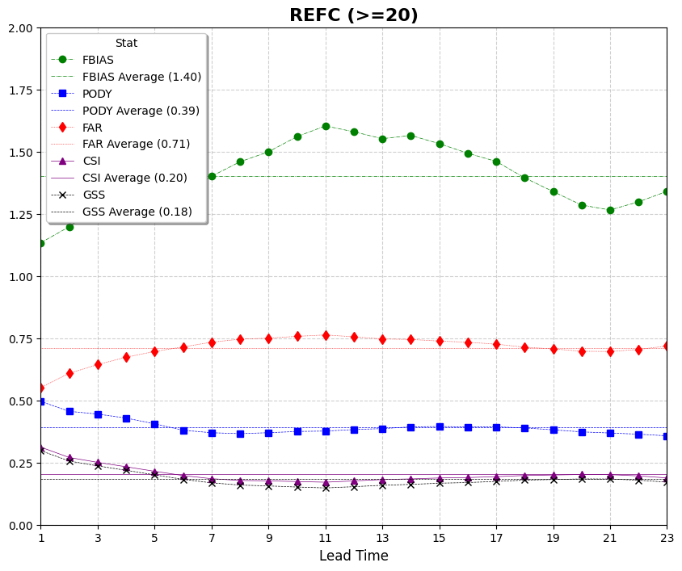

Plotting Use Case: Categorical Scores
=====================================

This use case demonstrates how to use VCasT's plotting module to visualize categorical verification metrics such as POD, FAR, CSI, FBIAS, and GSS for reflectivity forecasts.

It uses a sample configuration file (`plot.yaml`) to create a line plot from an aggregated dataset.

Prerequisites
-------------

Before running the example, you need an input file ``REFC_agg.data`` created in the previous use case :doc:`MET Stat Use Case: Categorical Scores <../met_stat/use_case_cts>`.

Run the Example
---------------

1. **Clone the test repository:**

   .. code-block:: bash

      git clone https://github.com/NOAA-GSL/VCasT-tests
      cd VCasT-tests/examples/MET/cts_metrics

2. **Run VCasT with the plotting YAML file:**

   .. code-block:: bash

      vcast plot.yaml

   This will generate plots for the specified categorical metrics.

YAML Configuration Explained
----------------------------

Below is the content of `plot.yaml`, which configures VCasT to:

- Load a pre-aggregated CSV file with categorical scores
- Plot `fcst_lead` on the x-axis and metric values on the y-axis
- Include multiple metrics like `pod`, `far`, `csi`, `fbias`, and `gss`

.. literalinclude:: ../../_static/cfg_examples/plot_cts.yaml
   :language: yaml
   :caption: Sample plot.yaml configuration
   :linenos:

Output
------

The generated plots will be saved to the location specified by `output_filename`, such as ``stat_agg_REFC.png``.

