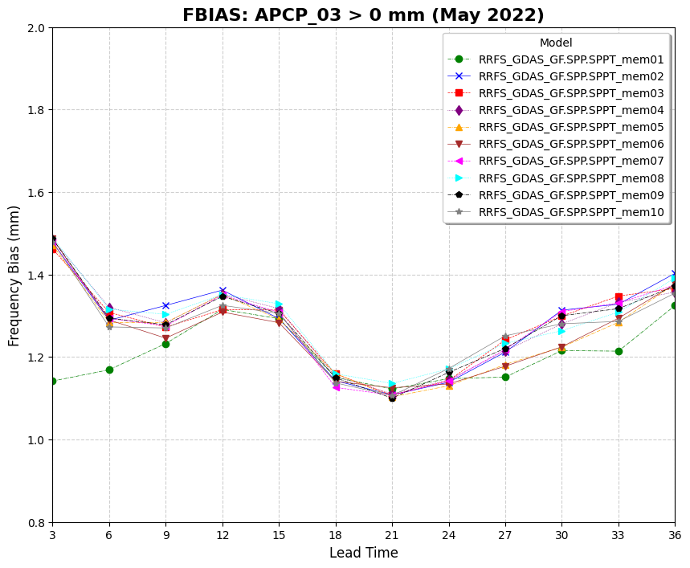

Plotting Use Case: FBIAS Across Models
======================================

This use case demonstrates how to use VCasT's plotting module to generate a comparison of FBIAS scores across multiple models using pre-processed MET statistics.

It uses a sample configuration file (`plot.yaml`) to create a line plot based on an aggregated dataset.

Prerequisites
-------------

Before running the example, you need an input file ``APCP_agg.data`` created in the previous use case :doc:`MET Stat Use Case: FBIAS Across Models <../met_stat/use_case_fbias_multiple_models>`.

Run the Example
---------------

1. **Clone the test repository:**

   .. code-block:: bash

      git clone https://github.com/NOAA-GSL/VCasT-tests
      cd VCasT-tests/examples/MET/fbias_multiple_models

2. **Run VCasT with the plotting YAML file:**

   .. code-block:: bash

      vcast plot.yaml

   This will generate the FBIAS comparison plot.

YAML Configuration Explained
----------------------------

Below is the content of `plot.yaml`, which configures VCasT to:

- Load a pre-aggregated CSV file with FBIAS values
- Plot `fcst_lead` on the x-axis and FBIAS on the y-axis
- Differentiate models
- Filter the plot to include only the `fbias` metric

.. literalinclude:: ../../_static/cfg_examples/plot_fbias.yaml
   :language: yaml
   :caption: Sample plot.yaml configuration
   :linenos:

Output
------

The generated plot will be saved to the location specified by `output_filename`, such as ``stat_FBIAS_APCP.png``.

