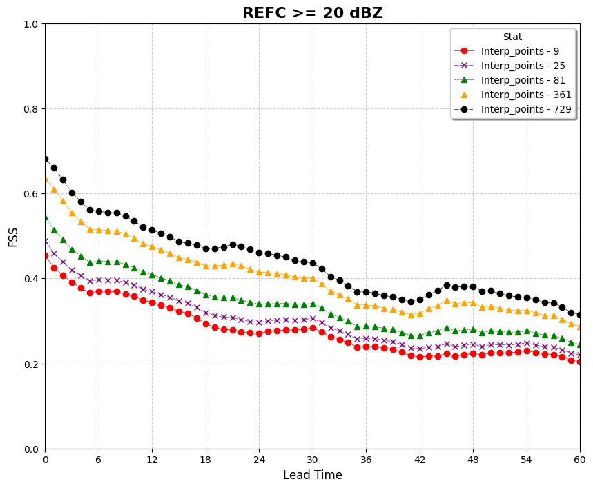

Plotting Use Case: Fractions Skill Score (FSS)
==============================================

This use case demonstrates how to use VCasT's plotting module to visualize the Fractions Skill Score (FSS) across models and lead times using pre-aggregated MET statistics.

It uses a sample configuration file (`plot.yaml`) to create a line plot from an aggregated dataset produced by the `NBRCNT` use case.

Prerequisites
-------------

Before running the example, you need an input file ``agg.data`` created in the previous use case :doc:`MET Stat Use Case: Fractions Skill Score (FSS) <../met_stat/use_case_fss>`.

Run the Example
---------------

1. **Clone the test repository:**

   .. code-block:: bash

      git clone https://github.com/NOAA-GSL/VCasT-tests
      cd VCasT-tests/examples/MET/fss

2. **Run VCasT with the plotting YAML file:**

   .. code-block:: bash

      vcast plot.yaml

   This will generate the FSS comparison plot.

YAML Configuration Explained
----------------------------

Below is the content of `plot.yaml`, which configures VCasT to:

- Load a pre-aggregated CSV file with FSS values
- Plot `fcst_lead` on the x-axis and `mean` FSS on the y-axis
- Differentiate models or smoothing scales
- Filter the plot to include only the `fss` metric

.. literalinclude:: ../../_static/cfg_examples/plot_fss.yaml
   :language: yaml
   :caption: Sample plot.yaml configuration
   :linenos:

Output
------

The generated plot will be saved to the location specified by `output_filename`, such as ``fss_REFC20.png``.

