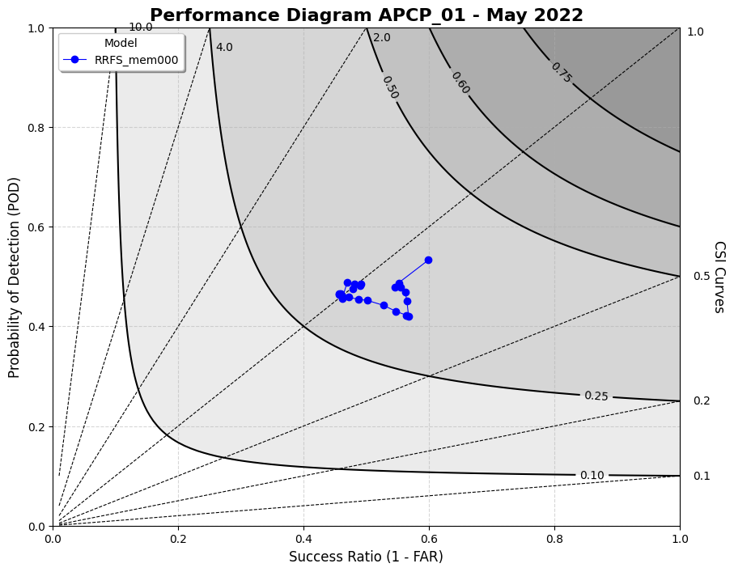

Plotting Use Case: Performance Diagram
======================================

This use case demonstrates how to use VCasT's plotting module to generate a performance diagram from pre-aggregated categorical statistics, such as POD and Success Ratio, computed using MET `.stat` files.

It uses a sample configuration file (`plot.yaml`) to create a performance diagram based on categorical forecast metrics.

Prerequisites
-------------

Before running the example, you need an input file ``APCP01_agg.data`` created in the previous use case :doc:`MET Stat Use Case: Performance Diagram <../met_stat/use_case_performance_diagram>`.

Run the Example
---------------

1. **Clone the test repository:**

   .. code-block:: bash

      git clone https://github.com/NOAA-GSL/VCasT-tests
      cd VCasT-tests/examples/MET/performance_diagram

2. **Run VCasT with the plotting YAML file:**

   .. code-block:: bash

      vcast plot.yaml

   This will generate a performance diagram comparing models or configurations.

YAML Configuration Explained
----------------------------

Below is the content of `plot.yaml`, which configures VCasT to:

- Load a pre-aggregated CSV file with categorical statistics
- Plot Success Ratio vs. POD (Probability of Detection)
- Differentiate series by model, variable, or threshold
- Filter the plot to include only the relevant metrics

.. literalinclude:: ../../_static/cfg_examples/plot_performance_diagram.yaml
   :language: yaml
   :caption: Sample plot.yaml configuration
   :linenos:

Output
------

The generated performance diagram will be saved to the location specified by `output_filename`, such as ``stat_agg_performance.png``.

