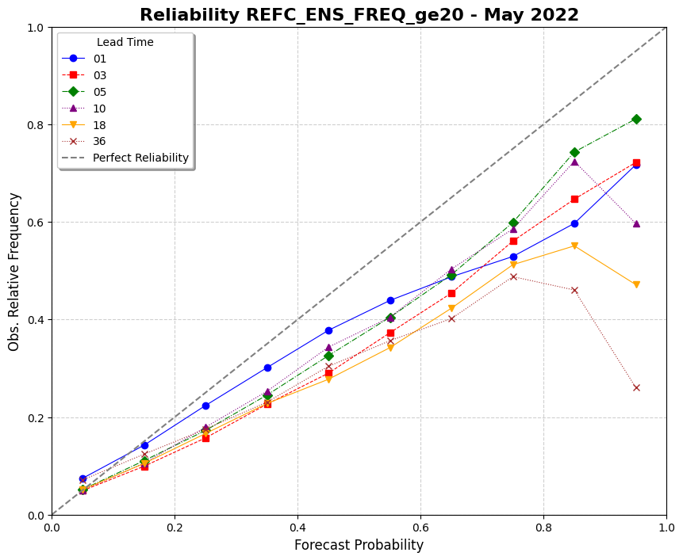

Plotting Use Case: Reliability Diagram
======================================

This use case demonstrates how to use VCasT's plotting module to generate a reliability diagram from pre-aggregated probabilistic forecast statistics computed using MET `.stat` files.

It uses a sample configuration file (`plot.yaml`) to create the diagram based on metrics like forecast probability and observed frequency.

Prerequisites
-------------

Before running the example, you need an input file ``agg.data`` created in the previous use case :doc:`MET Stat Use Case: Reliability Diagram <../met_stat/use_case_reliability>`.

Run the Example
---------------

1. **Clone the test repository:**

   .. code-block:: bash

      git clone https://github.com/NOAA-GSL/VCasT-tests
      cd VCasT-tests/examples/MET/reliability

2. **Run VCasT with the plotting YAML file:**

   .. code-block:: bash

      vcast plot.yaml

   This will generate a reliability diagram using the aggregated probabilistic metrics.

YAML Configuration Explained
----------------------------

Below is the content of `plot.yaml`, which configures VCasT to:

- Load a pre-aggregated CSV file with reliability metrics
- Plot forecast probability vs. observed frequency
- Optionally show the perfect reliability line and no-skill region

.. literalinclude:: ../../_static/cfg_examples/plot_reliability.yaml
   :language: yaml
   :caption: Sample plot.yaml configuration
   :linenos:

Output
------

The generated reliability diagram will be saved to the location specified by `output_filename`, such as ``stat_agg_reliability.png``.

