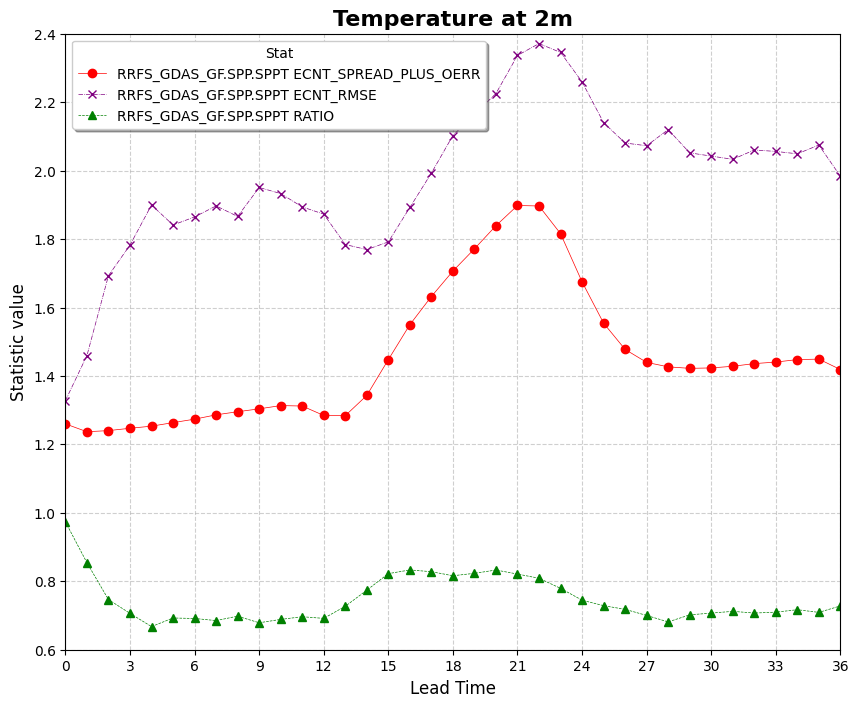

Plotting Use Case: Spread–Skill Relationship
============================================

This use case demonstrates how to use VCasT's plotting module to visualize the spread–skill relationship using pre-aggregated ensemble statistics computed from MET `.stat` files.

It uses a sample configuration file (`plot.yaml`) to generate a line plot showing the evolution of metrics such as spread, RMSE, and their ratio across lead times.

Prerequisites
-------------

Before running the example, you need an input file ``agg.data`` created in the previous use case :doc:`MET Stat Use Case: Spread–Skill Relationship <../met_stat/use_case_spread_skill>`.

Run the Example
---------------

1. **Clone the test repository:**

   .. code-block:: bash

      git clone https://github.com/NOAA-GSL/VCasT-tests
      cd VCasT-tests/examples/MET/spread-skill

2. **Run VCasT with the plotting YAML file:**

   .. code-block:: bash

      vcast plot.yaml

   This will generate a plot illustrating the spread–skill relationship across lead times.

YAML Configuration Explained
----------------------------

Below is the content of `plot.yaml`, which configures VCasT to:

- Load a pre-aggregated CSV file with ensemble verification statistics
- Plot `fcst_lead` on the x-axis and spread/skill metrics on the y-axis
- Focus on metrics like `spread`, `rmse`, and optionally the `ratio` (spread-plus-oerr / rmse)

.. literalinclude:: ../../_static/cfg_examples/plot_spread_skill.yaml
   :language: yaml
   :caption: Sample plot.yaml configuration
   :linenos:

Output
------

The generated plot will be saved to the location specified by `output_filename`, such as ``spread_skill.png``.

